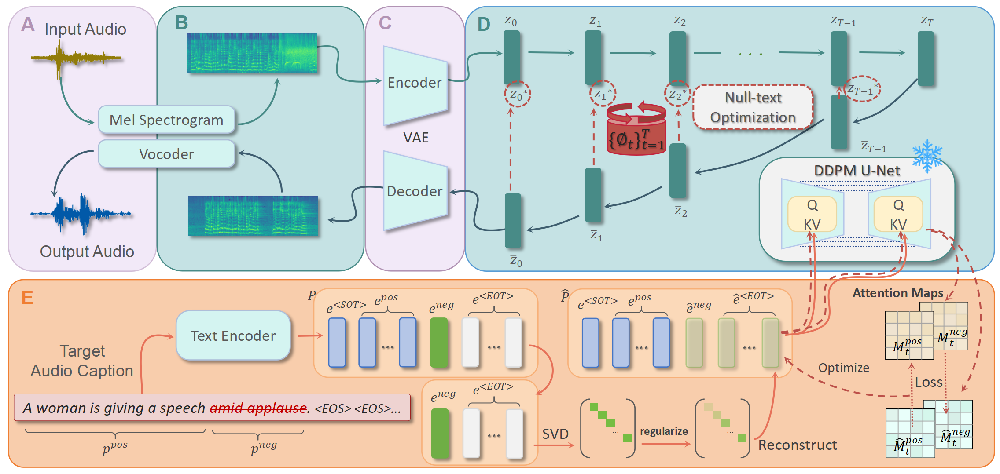
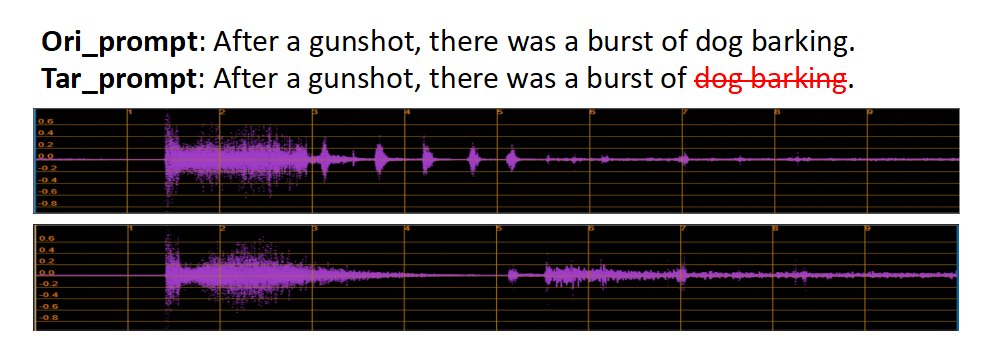
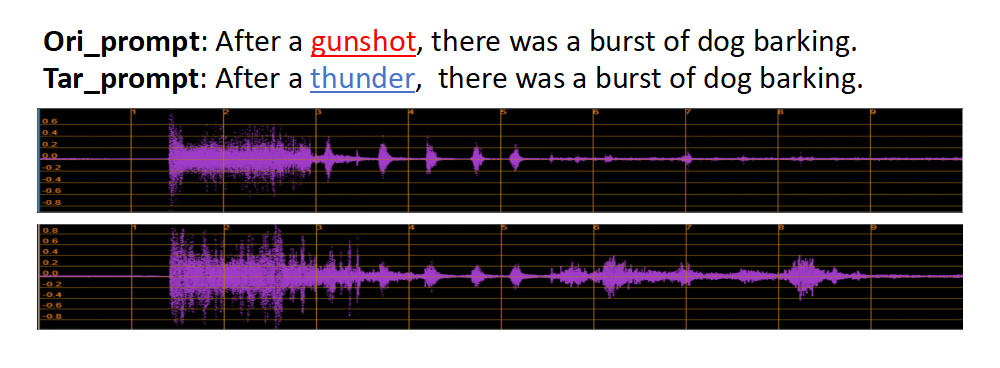
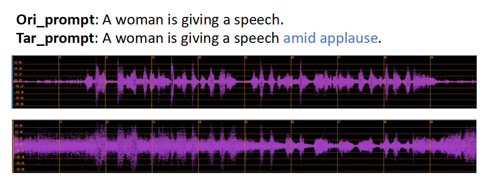

# AudioEditor: A Training-Free Diffusion-Based Audio Editing Framework

[Demo Page](todo)

Diffusion-based text-to-audio (TTA) generation has made substantial progress, leveraging Latent Diffusion Model (LDM) to produce high-quality, diverse and instruction-relevant audios. However, beyond generation, the task of audio editing remains equally important but has received comparatively little attention. Audio editing tasks face two primary challenges: executing precise edits and preserving the unedited sections. While workflows based on LDMs have effectively addressed these challenges in the field of image processing, similar approaches have been scarcely applied to audio editing. In this paper, we introduce AudioEditor, a training-free audio editing framework built on the pretrained diffusion-based TTA model. AudioEditor incorporates Null-text Inversion and EOT-Suppression methods, enabling the model to preserve original audio features while executing accurate edits. Comprehensive objective and subjective experiments validate the effectiveness of AudioEditor in delivering high-quality audio edits.

<div align="center">
  
</div>

## 🚀 Features

- **Pre-trained Model: Auffusion**  
  We use the pre-trained model Auffusion for audio editing tasks.  
  [Auffusion Repository](https://github.com/happylittlecat2333/Auffusion/tree/main) | [Model Download Link](https://huggingface.co/auffusion/auffusion)
- **Null-text Inversion**: Ensures preservation of unedited audio portions during the editing process.
- **EOT-suppression**: Enhance the model's ability to preserve original audio
features and improve editing capabilities.
- **Support multiple audio editing operations**: Add, Delete and Replace.
- **Easy integration with other TTA models**: Plug and play with existing TTA diffuser-based models.

## 📀 Installation

1. Clone the repository:

    ```bash
    git clone https://github.com/YuuhangJia/AudioEditor.git
    cd AudioEditor
    ```

2. Install the required dependencies:

    ```bash
    pip install -r requirements.txt
    ```

3. Set up additional environment variables or configurations (if any):

    ```bash
    export YOUR_ENV_VAR=your_value
    ```

## ⭐ Usage
We will release the code for the main methods proposed in our paper after its acceptance immediately!  

### 1️⃣ Delete




To run the deletion on an audio with a simple example, use the following command:
```bash
python main.py  --prompt "After a gunshot, there was a burst of dog barking" \
                --audio_path "audio_examples/input_audios/After a gunshot, there was a burst of dog barking.wav" \
                --token_indices "[[10,11]]" \
                --alpha "[1.,]" --cross_retain_steps "[.2,]"
```

### 2️⃣ Replace



To run the Replacement on an audio with a simple example, use the following command:
```bash
python main.py  --prompt "After a thunder, there was a burst of dog barking" \
                --audio_path "audio_examples/input_audios/After a gunshot, there was a burst of dog barking.wav" \
                --token_indices "[[3]]" \
                --alpha "[-0.001,]" --cross_retain_steps "[.2,]"
```

### 3️⃣ Add


```bash
python main.py  --prompt "A woman is giving a speech amid applause" \
                --audio_path "audio_examples/input_audios/A woman is giving a speech.wav" \
                --token_indices "[[7,8]]" \
                --alpha "[-0.001,]" --cross_retain_steps "[.2,]"
```
## 📐 Quantitative comparison
<html lang="en">
<head>
    <meta charset="UTF-8">
    <style>
        td, th {
        text-align: center;
    }
    </style>
</head>

<body>
    <table border="1" style="width: 100%;margin: 0 auto;">
        <caption><strong>Objective Evaluation Results</strong></caption>
        <thead>
            <tr>
                <td rowspan="2"><strong>Edit_Models</strong></td>
                <td rowspan="2"><strong>Edit_Type</strong></td>
                <td colspan="2"><strong>Overall Quality</strong></td>
                <td colspan="3"><strong>Similarity with (Regenerated_wavs)</strong></td>
                <td colspan="3"><strong>Similarity with (Original_wavs)</strong></td>
            </tr>
            <tr>
                <td><em><strong>Clap↑</strong></em></td>
                <td><em><strong>IS ↑</strong></em></td>
                <td><em><strong>FD ↓</strong></em></td>
                <td><em><strong>FAD ↓</strong></em></td>
                <td><em><strong>KL ↓</strong></em></td>
                <td><em><strong>FD ↓</strong></em></td>
                <td><em><strong>FAD ↓</strong></em></td>
                <td><em><strong>KL ↓</strong></em></td>
            </tr>
        </thead>
        <tbody>
            <tr>
                <td rowspan="4"><strong>Original_wavs</strong></td>
                <td>add</td>
                <td>51.4%</td>
                <td>5.64</td>
                <td>44.71</td>
                <td>5.28</td>
                <td>1.78</td>
                <td>-</td>
                <td>-</td>
                <td>-</td>
            </tr>
            <tr>
                <td>delete</td>
                <td>51.5%</td>
                <td>4.26</td>
                <td>51.82</td>
                <td>6.16</td>
                <td>1.85</td>
                <td>-</td>
                <td>-</td>
                <td>-</td>
            </tr>
            <tr>
                <td>replace</td>
                <td>41.6%</td>
                <td>4.41</td>
                <td>69.92</td>
                <td>7.88</td>
                <td>4.56</td>
                <td>-</td>
                <td>-</td>
                <td>-</td>
            </tr>
            <tr>
                <td><em><strong>Average</strong></em></td>
                <td>48.2%</td>
                <td>4.77</td>
                <td>55.48</td>
                <td>6.45</td>
                <td>2.73</td>
                <td>-</td>
                <td>-</td>
                <td>-</td>
            </tr>
            <tr>
                <td rowspan="4"><strong>Regenerated_wavs</strong></td>
                <td>add</td>
                <td>59.7%</td>
                <td>5.96</td>
                <td>-</td>
                <td>-</td>
                <td>-</td>
                <td>44.71</td>
                <td>5.28</td>
                <td>1.36</td>
            </tr>
            <tr>
                <td>delete</td>
                <td>59.1%</td>
                <td>4.47</td>
                <td>-</td>
                <td>-</td>
                <td>-</td>
                <td>51.82</td>
                <td>6.16</td>
                <td>2.39</td>
            </tr>
            <tr>
                <td>replace</td>
                <td>58.9%</td>
                <td>5.13</td>
                <td>-</td>
                <td>-</td>
                <td>-</td>
                <td>69.92</td>
                <td>7.88</td>
                <td>4.09</td>
            </tr>
            <tr>
                <td><em><strong>Average</strong></em></td>
                <td><strong>59.2%</strong></td>
                <td>5.19</td>
                <td>-</td>
                <td>-</td>
                <td>-</td>
                <td>55.48</td>
                <td>6.45</td>
                <td>2.61</td>
            </tr>
            <tr>
                <td rowspan="4"><strong>SDEdit(baseline)</strong></td>
                <td>add</td>
                <td>58.4%</td>
                <td>6.36</td>
                <td>27.89</td>
                <td>2.74</td>
                <td>0.79</td>
                <td>36.74</td>
                <td>3.08</td>
                <td>1.08</td>
            </tr>
            <tr>
                <td>delete</td>
                <td>53.3%</td>
                <td>5.31</td>
                <td>55.12</td>
                <td>6.65</td>
                <td>1.78</td>
                <td>40.43</td>
                <td>6.95</td>
                <td>0.88</td>
            </tr>
            <tr>
                <td>replace</td>
                <td>58.6%</td>
                <td>4.99</td>
                <td>29.76</td>
                <td>3.24</td>
                <td>0.80</td>
                <td>55.21</td>
                <td>7.00</td>
                <td>3.40</td>
            </tr>
            <tr>
                <td><em><strong>Average</strong></em></td>
                <td>56.8%</td>
                <td><strong>5.55</strong></td>
                <td><strong>37.59</strong></td>
                <td>4.21*</td>
                <td>1.12*</td>
                <td>44.13*</td>
                <td>5.68*</td>
                <td><strong>1.79</strong></td>
            </tr>
            <tr>
                <td rowspan="4"><strong>AudioEditor(ours)</strong></td>
                <td>add</td>
                <td>59.4%</td>
                <td>6.16</td>
                <td>27.83</td>
                <td>2.41</td>
                <td>0.85</td>
                <td>40.00</td>
                <td>3.52</td>
                <td>1.27</td>
            </tr>
            <tr>
                <td>delete</td>
                <td>54.1%</td>
                <td>4.75</td>
                <td>52.56</td>
                <td>5.02</td>
                <td>1.54</td>
                <td>37.16</td>
                <td>4.91</td>
                <td>1.05</td>
            </tr>
            <tr>
                <td>replace</td>
                <td>58.1%</td>
                <td>5.14</td>
                <td>28.80</td>
                <td>3.34</td>
                <td>0.79</td>
                <td>59.46</td>
                <td>7.52</td>
                <td>3.73</td>
            </tr>
            <tr>
                <td><em><strong>Average</strong></em></td>
                <td>57.6%*</td>
                <td>5.19*</td>
                <td>37.63*</td>
                <td><strong>3.27</strong></td>
                <td><strong>1.07</strong></td>
                <td><strong>43.48</strong></td>
                <td><strong>4.95</strong></td>
                <td>1.93*</td>
            </tr>
        </tbody>
    </table>
</body>
* indicates a suboptimal value, which may represent more desirable than optimal one in certain metrics.

</html>

## 🤝🏻 Contact
Should you have any questions, please contact 2120240729@mail.nankai.edu.cn

## 📚 Citation
Coming soon.

## 🐍 License
The code in this repository is licensed under the MIT License for academic and other non-commercial uses.

[//]: # (For commercial use of the code and models, separate commercial licensing is available. Please contact authors.)


## 🙏 Acknowledgment:
This code is based on the [P2P, Null-text](https://github.com/google/prompt-to-prompt) , [SuppressEOT](https://github.com/sen-mao/SuppressEOT) and [Auffusion](https://github.com/happylittlecat2333/Auffusion) repositories. 
